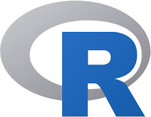

### Hi there 👋 I'm Chennakeshava NT

An Undergraduate Student at K.S.Institute of Technology pursuing my Bachelor's Degree in Computer Science Engineering. I am a hard-working, detail-oriented student. I have experience in Cross-Platform Mobile App Development and Web Development. I have served as a peer trainer for Android App Development Workshop.I'm an Explorer and a Learnaholic who has spent the last 3 years in learning Cross-Platform App development and Web development, I keep trying out new things which has lead me in the path of Data Science. I am currently working on gaining knowledge on Data Science and Python Programming Language.
- 🔭 I’m currently working on **SOS Contacts Application**
- 🌱 I’m currently learning **Data Science**
- 👯 I’m looking to collaborate on Projects that let me increase my experience in Data Science
- 🤔 I’m looking for help with **Machine Learning**
- 💬 Talk to me about Movies, Memes, Multiplier Games, Hackathons, Community Meet-Ups and Conferences
---
#### My Skills:
                       <!--  -->                    <!-- -->
---

#### Activity Status:

 

#### Connect with Me:
<!--            -->
1. Mail me at - Chennakeshavant@gmail.com
2. Connect me on LinkedIn - Chennakeshava NT
2. Follow me on instagram - @__chennakeshava_nt_

***If you find my work good, consider giving it a ⭐ or fork-ing to show some ❤️. It helps me stay on track and be motivated.***
***"Small Things makes perfection But, Perfection is no Small Thing"***
